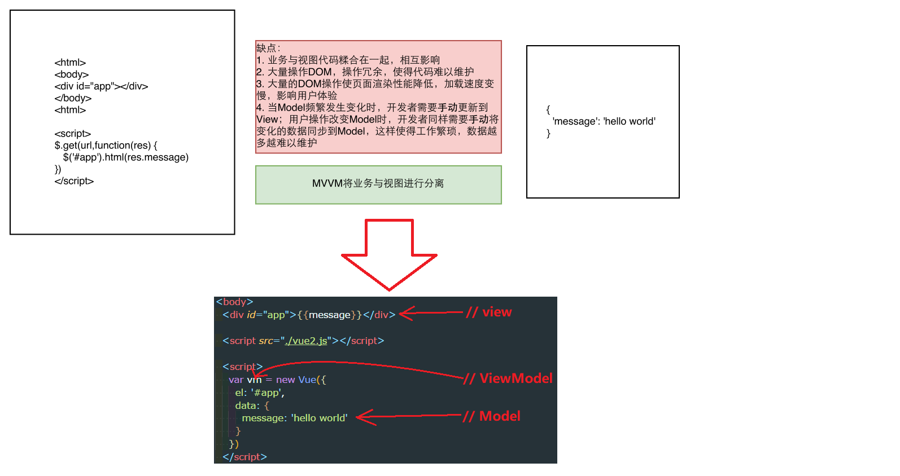
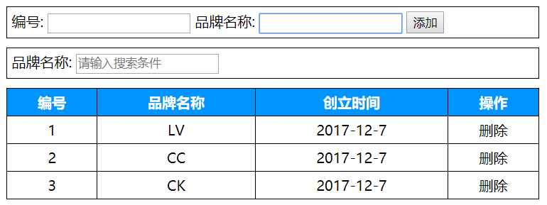

Vue基础-day01
===
<!-- TOC -->

- [课前准备](#课前准备)
  - [浏览器插件](#浏览器插件)
  - [VS Code插件](#vs-code插件)
  - [玩转Vs code](#玩转vs-code)
- [课程介绍](#课程介绍)
  - [为什么学习Vue](#为什么学习vue)
  - [什么是MVVM](#什么是mvvm)
  - [Vue初体验](#vue初体验)
- [Vue常用系统指令](#vue常用系统指令)
  - [插值表达式](#插值表达式)
  - [v-text](#v-text)
  - [v-html](#v-html)
  - [v-bind](#v-bind)
  - [v-for](#v-for)
  - [v-model](#v-model)
  - [v-on](#v-on)
  - [v-on按键修饰符](#v-on按键修饰符)
  - [v-if](#v-if)
  - [v-show](#v-show)
  - [v-cloak](#v-cloak)
- [案例-利用系统指令实现品牌案例管理](#案例-利用系统指令实现品牌案例管理)
  - [目的](#目的)
  - [资源准备](#资源准备)
  - [功能-数据展示实现](#功能-数据展示实现)
  - [功能-数据删除](#功能-数据删除)
  - [功能-数据添加](#功能-数据添加)
  - [功能-按回车键添加数据](#功能-按回车键添加数据)
  - [功能-输入框自动聚焦](#功能-输入框自动聚焦)
  - [ref](#ref)
  - [功能-时间格式化](#功能-时间格式化)
  - [过滤器](#过滤器)

<!-- /TOC -->

## 课前准备

### 浏览器插件

  * Vue.js devtools

### VS Code插件

自动补全标签
  * Auto Close Tag
  * Auto Complete Tag
  * Auto Rename Tag

开启一个服务器浏览HTML网页，第一次使用需要Ctrl + Shift + p输入 live server选择open
  * Live Server

路径自动补全
  * Path Intellisense

vue语法高亮和自动补全代码
  * Vetur
  * VueHelper

### 玩转Vs code

  *  [Vs Code奇淫技巧](https://github.com/Microsoft/vscode-tips-and-tricks)

  * Vs Code设置

  文件--->首选项--->设置，然后添加如下代码：

  ```json
    "emmet.syntaxProfiles": {
        "vue-html": "html",
        "vue": "html"
    },
    "emmet.includeLanguages": {
        "vue-html": "html",
        "vue": "html"
    }
  ```
## 课程介绍

### 为什么学习Vue

  
	
### 什么是MVVM

    - M => Model(数据模型)
    - V => View(视图模型,负责将数据模型转化成UI展现出来，就是那些DOM结构)
    - VM => ViewModel(一个同步View和Model的对象)



### Vue初体验

```html
<!DOCTYPE html>
<html lang="en">
<head>
  <meta charset="UTF-8">
  <meta name="viewport" content="width=device-width, initial-scale=1.0">
  <meta http-equiv="X-UA-Compatible" content="ie=edge">
  <title>Document</title>
  <!-- 1. 引入vue文件 -->
  <script src="./vue2.js"></script>
</head>
<body>
  <!-- 如果超过vue实例的管辖范围，这个{{}}作用就会失效 -->
  <div>{{msg}}</div>
  <div id="app">
    <!-- 5. 展示数据：通过插值表达式{{}} ，作用是专门用来渲染文本-->
    <h1>{{msg}}</h1>
  </div>
  <script>
    // 2. 创建vue实例，作用：他会监管我们的html代码
    var vm = new Vue({
      // 3. 通过一个el属性来指定vue实例的监管范围,后面跟一个id
      el: '#app',
      // 4. 用data属性将要展示的变量存起来,data后面跟一个对象
      data: {
        msg: 'hello world'
      }
    })
  </script>
</body>
</html>
```
## Vue常用系统指令

### 插值表达式

  ```html
    数据绑定最常见的形式，其中最常见的是使用插值表达式，写法是{{}} 中写表达式
    例如：<span>Message: {{ msg }}</span>
    Mustache 标签将会被替代为对应数据对象上 msg 属性（msg定义在data对象中）的值。
    无论何时，绑定的数据对象上 msg 属性发生了改变，插值处的内容都会更新。

    {{}}对JavaScript 表达式支持，例如：
    {{ number + 1 }}
    {{ ok ? 'YES' : 'NO' }}
    {{ message.split('').reverse().join('') }}

    但是有个限制就是，每个绑定都只能包含单个表达式，如下表达式无效：
    <!-- 这是语句，不是表达式 -->
    {{ var a = 1 }}

    <!-- 这也是语句，不是表达式 -->
    {{ number++ }} 会报警告：vue2.js:482 [Vue warn]: You may have an infinite update loop in a component render function.

    <!-- 流控制也不会生效，请使用三元表达式 -->
    {{ if (ok) { return message } }}
  ```

### v-text

  ```html
  <!-- v-text可以将一段文本渲染到指定的元素中,例如： -->
  <div v-text="msg"></div>
  new Vue({
      data:{
          msg:'hello world'
      }
  });

  <!-- 输出结果：-->
  <div>hello world</div>
  ```

### v-html

  ```html
  差值表达式和v-text会将数据解释为纯文本，而非 HTML 。
  为了输出真正的 HTML ，你需要使用 v-html 指令：
  例如：
  <div v-html="rawHtml"></div>
      new Vue({
          data:{
              rawHtml:'<h1>hello world</h1>'
          }
  })

  被插入的内容都会被当做 HTML,但是对于没有HTML标签的数据绑定时作用同v-text和{{}}
  ```

### v-bind

  ```html
  1、作用：可以给html元素或者组件动态地绑定一个或多个特性，例如动态绑定style和class

  2、举例：
      1、img的src从imageSrc变量中取得
          

          2、从classA, classB两个变量的值作为class的值，
          结果是：<div class="A B">classA, classB</div>        
          <div v-bind:class="[classA, classB]">classA, classB</div>

          3、isRed变量如果为true，则class的值为red，否则没有
          <div v-bind:class="{ red: isRed }">isred</div>

          4、div的class属性值一定有classA变量的值，而是否有classB和classC变量的值取决于isB和isC是否为true，二者一一对应
          <div v-bind:class="[classA, { classB: isB, classC: isC }]">数组对象</div>

          5、变量加常量
          <div v-bind:style="{ fontSize: size + 'px' }">size22</div>

          6、变量加常量的另一种写法
          

          7、对象数组
          <div v-bind:style="[styleObjectA, styleObjectB]">styleObjectA, styleObjectB</div>

  3、缩写形式
      
      <div :class="[classA, classB]">classA, classB</div>
      <div v-bind:class="{ red: isRed }">isred</div>
      <div v-bind:class="[classA, { classB: isB, classC: isC }]">数组对象</div>
      <div v-bind:style="{ fontSize: size + 'px' }">size22</div>
      
      <div v-bind:style="[styleObjectA, styleObjectB]">styleObjectA, styleObjectB</div>


    vue对象初始化
    <script>
      // 实例化vue对象（MVVM中的View Model）
      new Vue({
          // vm控制的区块为id为app的div，此div中的所有vue指令均可以被vm解析
          el:'#app',
          data:{
          // 数据 （MVVM中的Model）   
          imageSrc:'http://157.122.54.189:8998/vue/vuebase/chapter1/imgs/d1-11.png',
          isRed:true,
          classA:'A',
          classB:'B',
          isB:true,
          isC:true,
          size:22,
          styleObjectA:{color:'red'},
          styleObjectB:{fontSize:'30px'}
          },
          methods:{

          }
      })
  </script>
  ```

### v-for

  ```html
  <!-- 
    v-for用法：
      item in Array
      (item, index) in Array
      value in Object
      (value, key, index) in Object

    :key属性具有唯一性，不能重复，它能够唯一标识数组的每一项
    将来数据中的某一项的值发生了改变，则v-for只会更新当前项对应的这个dom元素的值，而不是更新整个数据，从而提高效率，参考https://www.zhihu.com/question/61064119/answer/183717717

    注意：以下变动不会触发视图更新
      1. 通过索引给数组设置新值
      2. 通过length改变数组
    解决：
      1. Vue.set(arr, index, newValue)
      2. arr.splice(index, 1, newValue)
    -->
    <ul>
      <li v-for="item in user">{{item.name}}</li>
      <li v-for="(item, index) in user" :key="index">{{index}}.{{item.name}}</li>
      <li>---------------华丽的分割线---------------</li>
      <li v-for="value in boss">{{value}}</li>
      <li v-for="(value, key, index) in boss"> {{index}}.{{key}}:{{value}}</li>
    </ul>
    <script>
    var vm = new Vue({
      el: '#app',
      data: {
        user: [
          {name: 'jack'},
          {name: 'neil'},
          {name: 'rose'}
        ],
        boss: {
          name: '马云',
          age: 50,
          money: 1000000002030
        }
      }
    })
    </script>
  ```

### v-model

  ```html
  1、在表单控件或者组件上创建双向绑定
  2、v-model仅能在如下元素中使用：
    input
    select
    textarea
    components（Vue中的组件）

  3、举例：
    <input type="text" v-model="uname" />

  new Vue({
      data:{
          uname:'' //这个属性值和input元素的值相互一一对应，二者任何一个的改变都会联动的改变对方
        }
  })
  ```

### v-on

  ```html
  1、作用：绑定事件监听，表达式可以是一个方法的名字或一个内联语句，
  如果没有修饰符也可以省略，用在普通的html元素上时，只能监听 原生
  DOM 事件。用在自定义元素组件上时，也可以监听子组件触发的自定义事件。

  2、常用事件：
      v-on:click
      v-on:keydown
      v-on:keyup
      v-on:mousedown
      v-on:mouseover
      v-on:submit
      ....

  3、示例：
    <!-- 方法处理器 -->
    <button v-on:click="doThis"></button>
    <!-- 内联语句 -->
    <button v-on:click="doThat('hello', $event)"></button>

    <!-- 阻止默认行为，没有表达式 -->
    <form v-on:submit.prevent></form>

   5、v-on的缩写形式：可以使用@替代 v-on:
    <button @click="doThis"></button>


  6、按键修饰符
    触发像keydown这样的按键事件时，可以使用按键修饰符指定按下特殊的键后才触发事件

    写法：
      <input type="text" @keydown.enter="kd1">  当按下回车键时才触发kd1事件

      由于回车键对应的keyCode是13，也可以使用如下替代
      <input type="text" @keydown.13="kd1">  当按下回车键时才触发kd1事件

      但是如果需要按下字母a（对应的keyCode=65）才触发kd1事件，有两种写法：
      1、由于默认不支持a这个按键修饰符，需要Vue.config.keyCodes.a = 65 添加一个对应,所以这种写法为：

      Vue.config.keyCodes.a = 65
      <input type="text" @keydown.a="kd1">  这样即可触发

      2、也可以之间加上a对应的数字65作为按键修饰符
      <input type="text" @keydown.65="kd1">  这样即可触发

      键盘上对应的每个按键可以通过 http://keycode.info/ 获取到当前按下键所对应的数字
  ```

### v-on按键修饰符

  * 作用说明

  ```html
    文档地址：https://cn.vuejs.org/v2/guide/events.html#键值修饰符

    在监听键盘事件时，我们经常需要监测常见的键值。 Vue 允许为 v-on 在监听键盘事件时添加按键修饰符：
    .enter
    .tab
    .delete (捕获 “删除” 和 “退格” 键)
    .esc
    .space
    .up
    .down
    .left
    .right
  ```

  * 可以自定义按键别名

  ```html
    // 在Vue2.0版本中扩展一个f1的按键修饰符写法：
    Vue.config.keyCodes.f1 = 112

    // 使用
    <button @keyup.f1="someFunc"></button>
  ```

### v-if

  ```html
  1、作用：根据表达式的值的真假条件来决定是否渲染元素，如果条件为false不渲染（达到隐藏元素的目的），为true则渲染。在切换时元素及它的数据绑定被销毁并重建

  2、示例：
    <!-- Handlebars 模板 -->
    {{#if isShow}}
      <h1>Yes</h1>
    {{/if}}

    通常我们使用写法居多：
    <h1 v-if="isShow">Yes</h1>

    也可以用 v-else 添加一个 “else” 块：
    <h1 v-if="isShow">Yes</h1>
    <h1 v-else>No</h1>

    注意：v-else 元素必须紧跟在 v-if 元素否则它不能被识别。

    new Vue({
        data:{
          isShow:true
        }
    });
  ```

### v-show

  ```html
  1、根据表达式的真假值，切换元素的 display CSS 属性，如果为false，则在元素上添加 display:none来隐藏元素，否则移除display:none实现显示元素

  2、示例：
      <h1 v-show="isShow">Yes</h1>

      new Vue({
          data:{
            isShow:true
              }
      });

  3、v-if和v-show的总结：
      v-if和v-show 都能够实现对一个元素的隐藏和显示操作,但是v-if是将这个元素添加或者移除到dom中，而v-show
      是在这个元素上添加 style="display:none"和移除它来控制元素的显示和隐藏的
  ```

### v-cloak

  ```html
  v-cloak指令保持在元素上直到关联实例结束编译后自动移除，v-cloak和 CSS 规则如 [v-cloak] { display: none } 一起用时，这个指令可以隐藏未编译的 Mustache 标签直到实例准备完毕。
  通常用来防止{{}}表达式闪烁问题
  例如：
  <style>
  [v-cloak] { display: none }
  </style>

  <!-- 在span上加上 v-cloak和css样式控制以后，浏览器在加载的时候会先把span隐藏起来，知道 Vue实例化完毕以后，才会将v-cloak从span上移除，那么css就会失去作用而将span中的内容呈现给用户 -->
  <span v-cloak>{{msg}}</span>    

  new Vue({
      data:{
          msg:'hello ivan'
        }
  })
  ```

## 案例-利用系统指令实现品牌案例管理

### 目的

  通过案例熟悉Vue系统指令的用法和结构的写法练习，做到知识点的巩固和学会
  应用，并且在案例的扩展需求中，学习Vue新知识点，做到先有需求，再有知识点
  学习，最后到知识点的应用，让学员学习知识点的同时学会知识点的应用

### 资源准备

  * 效果图<br/>
    

  * 案例html结构
  ```html
    <body>
    <div id="app">
    <div class="add">
        编号:<input type="text">
        品牌名称:<input type="text">
        <input type="button" value="添加">
    </div>

    <div class="add">
        品牌名称:<input type="text" placeholder="请输入搜索条件">
    </div>

    <div>
        <table class="tb">
            <tr>
                <th>编号</th>
                <th>品牌名称</th>
                <th>创立时间</th>
                <th>操作</th>
            </tr>
            <tr >
                <td colspan="4">没有品牌数据</td>
            </tr>
        <!-- 动态生成内容tr -->
        </table>
    </div>
    </div>
    </body>
  ```

  * 案例css样式

  ```html
    <style>

      #app{
          width:600px;
              margin:10px auto;
      }
        .tb{
            border-collapse:collapse;
            width: 100%;
        }
        .tb th{
            background-color: #0094ff;
            color:white;
        }

        .tb td,.tb th{
            padding:5px;
            border:1px solid black;
            text-align: center;
        }

        .add{
            padding: 5px;
            border:1px solid black;
            margin-bottom: 10px;
        }
    </style>
  ```

### 功能-数据展示实现

  1. 在 data 中添加 一个名称为 list的变量，类型为数组,存放品牌数据的对象,格式为:{id:1,name:'宝马',ctime:Date()}

  ```js
  var vm = new Vue({
    el: '#app',
    data: {
      list: [
        {id: 1, title: 'LV', ctime: new Date()},
        {id: 2, title: 'CC', ctime: new Date()},
        {id: 3, title: 'CK', ctime: new Date()},
      ]
    }
  })
  ```

  2. 在table中的“动态生成内容tr”位置使用v-for指令遍历list数组数据生成表格内容行，注意要写`:key`

  ```html
        <tr v-for="(item, index) in list" :key="index">
          <td>{{item.id}}</td>
          <td>{{item.title}}</td>
          <td>{{item.ctime}}</td>
          <td>
            <a href="javascript:void(0)">删除</a>
          </td>
        </tr>
  ```

  3. 处理 “没有品牌数据” 提示问题,代码如下

  ```html
利用：v-if进行判断，当list为空时，才显示没有品牌数据

 <tr v-if="list.length==0">
    <td colspan="4">没有品牌数据</td>
</tr>
  ```

### 功能-数据删除

  1. 给按钮绑定删除方法，并传入一个id

  ```html
  <a href="javascript:void(0)" @click="deleteData(item.id)">删除</a>
  ```

  2. Vue实例中定义删除的方法
  ```js
    methods: {
      deleteData(id) {
        // 返回满足函数条件的数组的项的index
        var index = this.list.findIndex(item => {
          return item.id === id
        })
        // 删除该索引对应的值
        this.list.splice(index, 1)
      }
    }
  ```

### 功能-数据添加

  * 效果图</br>
    

  1. 实现步骤1：在Vue对象实例的data中添加一个product对象{id:0,name:'',ctime:Date()}

  ```js
 new Vue({
    el: '#app',
    data: {
        product:{id:0,name:'',ctime:Date()},        
        list:[
            {id:1,name:'宝马',ctime:Date()},
            {id:2,name:'奔驰',ctime:Date()}
        ]
    },
    methods: {      
    }
  })
  ```

  2. 实现步骤2：在编号和品牌名称文本框中利用v-model对product对象中的id和name属性进行一一绑定 同时在添加按钮上利用 v-on:click注册事件addData

  ```html
  编号:<input type="text" v-model="product.id">
  品牌名称: <input type="text" v-model="product.name">
  <input type="button" value="添加" @click="addData">
  ```

  3. 实现步骤3：在Vue对象实例的methods中添加一个 addData的方法实现添加逻辑即可完成

  ```js
  new Vue({
      // vm控制的区块为id为app的div，此div中的所有vue指令均可以被vm解析
      el: '#app',
      data: {
          product:{id:0,name:'',ctime:Date()},
          list:[
              {id:1,name:'宝马',ctime:Date()},
              {id:2,name:'奔驰',ctime:Date()}
          ]
      },
      methods: {
          addData(){
              // 修改品牌添加时间为当前时间
              this.product.ctime = Date();

              // 添加数据到品牌列表中
              this.list.push(this.product);

              // 清空product
              this.product = {id:0,name:'',ctime:Date()};
          }
      }
  })
  ```

### 功能-按回车键添加数据

  **关键点：利用v-on的.enter按键修饰符实现，回车键的keycode=13**</br>
  

  ```html
  品牌名称: <input type="text" v-model="product.name" @keydown.13="addData">

  <!-- 或者 -->
  品牌名称: <input type="text" v-model="product.name" @keydown.enter="addData">
  ```
### 功能-输入框自动聚焦

  在vue中实现这个需求有三种方式：
  * 可以使用document.getElementById()获取到文本框元素对象后调用其focus()方法和设置style属性
  * 可以在文本框上元素上增加一个 ref="自定义名称"，再使用this.$refs.自定义名称.focus()和
    this.$refs.自定义名称.style="color:red" 设置style属性
  * 使用自定义指令实现封装

  > 注意：前两种方式的代码需要写到生命周期事件：mounted(){}中

  1. 原生js操作DOM实现

  ```html
    // html代码
    编号:<input type="text" v-model="product.id" id="id">

    // vue对象mounted(){}中代码
    mounted(){
        document.getElementById('id').focus();
        document.getElementById('id').style="color:red";
    }
  ```

  2. ref方式实现

  ```html
    // html代码：
    编号:<input type="text" v-model="product.id" ref="id">

    // vue对象mounted(){}中代码
    mounted(){
        this.$refs.id.focus();
        this.$refs.id.style="color:red";
      }
  ```
  3. 使用自定义指令

  * 使用说明

    - 利用Vue.directive('指令id',{inserted:function(el,binding){}})
    - 参数说明
      + 指令id可由程序员自行定义，注意和系统指令名称有所区别，例如：
      focus,在某个元素上具体使用的时候请在 指令id前面再加上v-,例如
      `<input v-focus>`

      + 第二个参数是一个对象，其中inserted是一个函数，表示 “被绑定元素插入父节点时调用”
          * inserted的参数：
            - el参数：表示使用此自定义指令的dom对象
            - binding参数：一个对象，包含以下属性：
              + name：指令名，不包括 v- 前缀。
              + value：指令的绑定值，例如：v-focus="colorvalue", value 的值是colorvalue这个变量的值，colorvalue定义在data(){}中
              + expression：绑定值的字符串形式。例如 v-focus="colorvalue" ，expression 的值是 "colorvalue"

  * 开始使用Vue.directive()封装自定义指令v-focus实现光标自动定位

  ```html
  1、定义指令color
    Vue.directive('color',{
        inserted:function(el,binding){
          //将颜色设置给使用v-color指令的元素上
          el.style.color=binding.value;
        }
    });


  2、 在dom元素上使用指令，注意加上前缀 v-
  编号:<input type="text" v-model="product.id" v-color="colorvalue">

  3、在Vue对象实例中的data(){}中定义colorvalue
    new Vue({
      data: {
          colorvalue:'red'
      }
    });
  ```

### ref

ref的作用类似于document.getElementByID,在vue中想要获取一个dom对象或者组件对象，则只需要 在此元素上添加一个 ref="自定义名称" ，再使用 this.$refs.自定义名称即可获取

  ```html
  <html>
  <head>
    <script src="vue2.js"></script>
  </head>
    <body>
      <div id="app">
      <span ref="sp"></span>
      </div>
    </body>
    <script>
      new Vue({
        el:'#app',
        methods:{
          getobj:function(){
            //获取到span元素的dom对象，类似于使用document.getElementByID('sp')
            // spanobj就是span的dom对象，可以调用 style,innerHTML,innerText等进行操作
              var spanobj =  this.$refs.sp;              
          }
        }
        })
    </script>
  </html>
  ```

### 功能-时间格式化

  ```html
  // 定义全局过滤器datefmt
  Vue.filter('datefmt',function(input){
      var date = new Date(input);
      var year = date.getFullYear();
      var m = date.getMonth() + 1;
      var d = date.getDate();            
      var fmtStr = year+'-'+m +'-'+d;
      return fmtStr; //返回输出结果
  });

  // 调用, 注意datefmt的第一个参数默认就是管道符左边的值
  <td>{{item.ctime | datefmt }}</td>
  ```

### 过滤器

  1. 私有过滤器

  * 定义方式

        可以在 new Vue({filters：{}})中的filters中注册一个私有过滤器

        定义格式：
        new Vue({
          el:'#app',
          filters:{        
              '过滤器名称':function(管道符号|左边对象的值,参数1,参数2,....) {
                return 对管道符号|左边参数的值做处理以后的值
              })    
          }
          });

        Vue2.0 调用过滤器传参写法：
        <span>{{ msg | 过滤器id('参数1','参数2' ....) }}</span>

  * (应用示例)自定义私有过滤器实现日期格式化

      ```html
        1、 定义私有的日期格式化过滤器：
        new Vue({
            el:'#app',
            data:{
                time:new Date()
            },
            filters:{
                //定义在 VM中的filters对象中的所有过滤器都是私有过滤器
                datefmt:function(input,splicchar){
                    var date = new Date(input);
                    var year = date.getFullYear();
                    var m = date.getMonth() + 1;
                    var d = date.getDate();            
                    var fmtStr = year+splicchar+m +splicchar+d;
                    return fmtStr; //返回输出结果
                }
            }
        });
        2、使用
        <div id="app">
          {{ time | datefmt('-') }} //Vue2.0传参写法
        </div>
      ```

  2. 全局过滤器

  * 定义方式

        可以用全局方法 Vue.filter() 注册一个全局自定义过滤器，它接收两个参数：过滤器 ID 和过滤器函数。过滤器函数以值为参数，返回转换后的值

        定义格式：
        Vue.filter('过滤器名称', function (管道符号|左边参数的值,其他参数1,其他参数2,....) {
          return 对管道符号|左边参数的值做处理以后的值
        })

        Vue2.0 使用：参数调用时用()，多个参数中间使用逗号分开
        <span>{{ msg | 过滤器名称('参数1','参数2' ....) }}</span>

  * (应用示例)自定义全局过滤器实现日期格式化

    ```html
      1、 定义全局的日期格式化过滤器：
      Vue.filter('datefmt',function(input,splicchar){
          var date = new Date(input);
          var year = date.getFullYear();
          var m = date.getMonth() + 1;
          var d = date.getDate();            
          var fmtStr = year+splicchar+m +splicchar+d;
          return fmtStr; //返回输出结果
      });    

      2、使用
          <div id="app">
            {{ time | datefmt('-') }} //Vue2.0传参写法
          </div>
          
        <script>  
            new Vue({
                el:'#app1',
                data:{
                    time:new Date()
                }
            });
        </script>
    ```

        methods: {
            // 1.0 动画进入前
            beforeEnter: function (el) {
                console.log('1.0 beforeEnter');
        
                // 在这个方法中设定当前动画元素的起始位置
                el.style = "padding-left:100px";
            },
            // 2.0 动画执行中
            // el:动画的元素dom对象
            // done:enter事件执行完以后的回调，执行了它之后，afterEnter事件才会执行
            enter: function (el, done) {
                console.log('2.0 enter');
        
                var step = 3;
                var interval = setInterval(() => {
                    el.style.paddingLeft = (100 - step) + 'px';
                    step++;
                    if (parseInt(el.style.paddingLeft) <= 0) {
                        clearInterval(interval)
                        // 动画结束后必须执行done()函数
                        done()
                    }
                }, 10)
            },
            // 3.0 动画执行完毕
            afterEnter: function (el) {
                console.log('3.0 afterEnter');
                // 将isshow重置为false即可
                this.isshow = false;
            },
            showhide: function () {
                this.isshow = !this.isshow;
            }
        }


# Vue基础-day02

<!-- TOC -->

- [computed](#computed)
- [watch](#watch)
- [案例-利用系统指令实现品牌案例管理](#案例-利用系统指令实现品牌案例管理)
  - [功能-实现品牌列表数据过滤功能](#功能-实现品牌列表数据过滤功能)
  - [功能-利用vue的动画实现删除提示框动画呈现和离开](#功能-利用vue的动画实现删除提示框动画呈现和离开)
- [axios(基于 promise 的 HTTP 库)](#axios基于-promise-的-http-库)
  - [get请求示例](#get请求示例)
  - [post请求示例](#post请求示例)
- [案例-品牌管理API](#案例-品牌管理api)
- [案例-axios版获取及删除数据](#案例-axios版获取及删除数据)
- [vue-resource(不推荐使用)](#vue-resource不推荐使用)
- [vue过渡&动画](#vue过渡动画)
  - [transition的作用](#transition的作用)
  - [transition结合css实现过渡](#transition结合css实现过渡)
  - [transition结合animate.css实现过渡](#transition结合animatecss实现过渡)
  - [transition结合钩子函数实现过渡](#transition结合钩子函数实现过渡)

<!-- /TOC -->

## computed

计算属性出现的目的是解决模板中放入过多的逻辑会让模板过重且难以维护的问题；计算属性是基于它们的依赖进行缓存的

```js
    computed: {
      fullName: function () {
        console.log(this.firstName + this.lastName)
        return this.firstName + this.lastName
      }
    }
```

## watch

侦听器（watch）用来观察和响应 Vue 实例上的数据变动

```js
  watch: {
    firstName: function (val) {
      this.fullName = val + ' ' + this.lastName
    },
    lastName: function (val) {
      this.fullName = this.firstName + ' ' + val
    }
  }
```

注意：通常情况下用computed，当需要在数据变化时**执行异步**或**开销较大**的操作时，用watch

## 案例-利用系统指令实现品牌案例管理

### 功能-实现品牌列表数据过滤功能

利用两种方式实现：

1. watch 监听器

```js
1. 在data(){}中定义searchvalue变量，作为存储用户是输入搜索值
   new Vue({
        // vm控制的区块为id为app的div，此div中的所有vue指令均可以被vm解析
        el: '#app',
        data: {
            searchvalue:''
             listold:[
                {id:1,name:'宝马',ctime:Date()},
                {id:2,name:'奔驰',ctime:Date()}
            ],
             list:[
                {id:1,name:'宝马',ctime:Date()},
                {id:2,name:'奔驰',ctime:Date()}
            ]
          },
           methods: {
            adddata(){
                this.product.ctime = Date();
                this.list.push(this.product);
                this.product = {id:0,name:'',ctime:Date()};
                // 为了防止搜索出来的新数组覆盖list，需要利用listold来存储一个list中完整的值
                this.listold = this.list;
            }
        },
        });


2. 双向数据绑定searchvalue
<div class="add">
    品牌名称:<input type="text" v-model="searchvalue" placeholder="请输入搜索条件">
</div>

3. 在watch中监控searchvalue变量的值，当值有改变，则触发方法searchvalue
new Vue({
  watch:{
          // 监控searchvalue变量的值，当值有改变，则触发方法
          // newval:searchvalue变量改变以后的值
          //oldval:searchvalue变量改变之前的值
            'searchvalue':function(newval,oldval){
              // 为了防止搜索出来的新数组覆盖list，需要利用listold来存储一个list中完整的值
                this.list=  this.listold.filter(item=>item.name.indexOf(newval)!=-1);
            }
        }
    });
```

1. computed 计算属性

```js
1. 在data(){}中定义searchvalue变量，作为存储用户是输入搜索值,利用computed定义计算属性来实现按照条件筛选数据逻辑
new Vue({
        // vm控制的区块为id为app的div，此div中的所有vue指令均可以被vm解析
        el: '#app',
        data: {
            searchvalue:''
          },
        computed:{
          listdata(){
              return this.list.filter(item=>item.name.indexOf(this.searchvalue)!=-1);
          }
        }
        });

2. 在v-for中遍历计算属性listdata数组中的值
 <tr v-for="item in listdata" :key="item.id">

由计算属性的特点可以知道：当改变了list数组中的值以后，会自动触发计算属性listdata的执行，从而更新v-for对于的列表
```

### 功能-利用vue的动画实现删除提示框动画呈现和离开

  [transition官方文档](https://cn.vuejs.org/v2/guide/transitions.html)

1. transition结合css实现

```html
      // 1. 用transition组件包裹需要添加过渡的元素，并添加name属性
      <transition name="slide">
          <span v-if="isshow">hello 黑马</span>
      </transition>

      // 2. 定义以slide开头的css类
      <style>
        /* 控制整个动画的执行过程 */
        .slide-enter-active,.slide-leave-active {
            transition: all 2s;
        }

        /* 设定动画出现的起始位置和动画离开的结束位置 */
        .slide-enter,.slide-leave-to {
            padding-left:100px;
        }

       /* 设定动画离开的起始位置，和动画进入的结束位置 */
        .slide-enter-to,.slide-leave {
            padding-left:0px;
        }
      </style>

      // 3. 在点击事件中控制元素显示与隐藏
      <button @click="toggleShow">显示/隐藏</button>

      // 4. 定义一个isshow变量，用来控制元素显示或隐藏，并在点击事件中改变它的值
      // 实例化vue对象（MVVM中的View Model）
      new Vue({
          // vm控制的区块为id为app的div，此div中的所有vue指令均可以被vm解析
          el: '#app',
          data: {
              // 数据 （MVVM中的Model）   
              isshow: false
          },
          methods: {
              toggleShow: function () {
                  this.isshow = !this.isshow;
              }
          }
      })
```

1. transition结合animate.css实现

```html
    // 1. 导入animate.css

    // 2. 使用
    <link rel="stylesheet" href="./animate.css">
    <transition
      enter-active-class="animated fadeInRight" 
      leave-active-class="animated fadeOutRight"
      >

    <span style="display:block;width:300px;" v-if="isshow">hello 黑马</span>
    </transition>

    // 利用methods中的方法去控制data中的isshow属性，实现元素的显示与隐藏
```

1. transition结合动画钩子函数实现

> 注意:enter和leave钩子中，当动画结束一定要调用done()函数，不然后续钩子函数不会被调用

```html
  <body>
      <div id="app">
          <button @click="showhide">显示/隐藏</button>
          <br />

          <!-- 2.0 在想要进行动画的元素上使用 <transition>标签包住
              transition: 
              动画进入事件：
              @before-enter
              @enter
              @after-enter
              -->
          <transition 
              @before-enter="beforeEnter" 
              @enter="enter" 
              @after-enter="afterEnter"
          >
              <span class="show" v-if="isshow">hello 黑马</span>
          </transition>
      </div>

  </body>

  <script>
      // 实例化vue对象（MVVM中的View Model）
      new Vue({
          // vm控制的区块为id为app的div，此div中的所有vue指令均可以被vm解析
          el: '#app',
          data: {
              // 数据 （MVVM中的Model）   
              isshow: false
          },
          methods: {
              // 1.0 动画进入前
              beforeEnter: function (el) {
                  console.log('1.0 beforeEnter');

                  // 在这个方法中设定当前动画元素的起始位置
                  el.style = "padding-left:100px";
              },
              // 2.0 动画执行中
              // el:动画的元素dom对象
              // done:enter事件执行完以后的回调，执行了它之后，afterEnter事件才会执行
              enter: function (el, done) {
                  console.log('2.0 enter');

                  var step = 3;
                  var interval = setInterval(() => {
                      el.style.paddingLeft = (100 - step) + 'px';
                      step++;
                      if (parseInt(el.style.paddingLeft) <= 0) {
                          clearInterval(interval)
                          // 动画结束后必须执行done()函数
                          done()
                      }
                  }, 10)
              },
              // 3.0 动画执行完毕
              afterEnter: function (el) {
                  console.log('3.0 afterEnter');
                  // 将isshow重置为false即可
                  this.isshow = false;
              },
              showhide: function () {
                  this.isshow = !this.isshow;
              }
          }
      })
  </script>
```

## axios(基于 promise 的 HTTP 库)

  [axios文档](https://github.com/axios/axios)

1. http请求报文

   浏览器与服务器数据交互是遵循http协议的，当浏览器要访问服务器的时候，浏览器需要将相关请求数据提交给服务器（例如：浏览器信息，url地址，参数等），通常是通过请求报文来提交的

   - 请求报文的格式分为：
     1. 请求报文行
     2. 请求报文头
     3. 请求报文体

   

2. http响应报文

   当浏览器请求服务器的时候，服务器需要将数据返回给浏览器，这种数据是通过响应报文响应回浏览器的

   - 响应报文的格式分为：
     1. 响应报文行
     2. 响应报文头
     3. 响应报文体

   

### get请求示例

```js
    axios.get('/user?ID=12345')
      .then(function (response) {
          console.log(response);
      })
      .catch(function (error) {
          console.log(error);
      });

    // 或者
    axios.get('/user', {
        params: {
          ID: 12345
        }
      })
      .then(function (response) {
        console.log(response);
      })
      .catch(function (error) {
        console.log(error);
      });
```

  演示代码

```js
    methods: {
      getData: function () {
        var url = 'http://157.122.54.189:9093/api/getprodlist'
        axios.get(url)
          .then(res => {
            this.list = res.data.message
            console.log(this.list);
          })
          .catch(error => {
            console.log(error);
          })
      }
    }
```

### post请求示例

```js
    axios.post('/user', {
      firstName: 'Fred',
      lastName: 'Flintstone'
    })
    .then(function (response) {
      console.log(response);
    })
    .catch(function (error) {
      console.log(error);
    });
```

  演示代码

```js
    methods: {
      getData: function () {
        var url = 'http://157.122.54.189:9093/api/addproduct'
        axios.post(url, "name=hello")
          .then(res => {
            console.log(res);
          })
          .catch(error => {
            console.log(error);
          })
      }
    }
```

## 案例-品牌管理API

| 接口说明         | URL                                           | 请求方式 | 参数                | 成功返回                                                     | 失败返回                                                     |
| ---------------- | --------------------------------------------- | -------- | ------------------- | ------------------------------------------------------------ | ------------------------------------------------------------ |
| 获取品牌数据列表 | http://157.122.54.189:9093/api/getprodlist    | GET      | searchvalue（可选） | {"status": 0,"message": [{"id": 104772,"name": "LV","ctime": "2017-12-05T08:35:57.000Z"}]} | 未做处理                                                     |
| 添加品牌数据     | http://157.122.54.189:9093/api/addproduct     | POST     | name（必填）        | {"status": 0,"message": "新增品牌成功"}                      | 未做处理                                                     |
| 删除品牌数据     | http://157.122.54.189:9093/api/delproduct/:id | GET      | id（必填）          | {"status": 0, "message": "删除品牌数据ok"}                   | {"status": 1,"message": "ER_BAD_FIELD_ERROR: Unknown column 'xxx' in 'where clause'"} |

## 案例-axios版获取及删除数据

```html
<!DOCTYPE html>
<html lang="en">

<head>
  <meta charset="UTF-8">
  <meta name="viewport" content="width=device-width, initial-scale=1.0">
  <meta http-equiv="X-UA-Compatible" content="ie=edge">
  <title>Document</title>
  <script src="./vue2.js"></script>
  <script src="./axios.js"></script>
  <style>
    #app {
      width: 600px;
      margin: 10px auto;
    }

    .tb {
      border-collapse: collapse;
      width: 100%;
    }

    .tb th {
      background-color: #0094ff;
      color: white;
    }

    .tb td,
    .tb th {
      padding: 5px;
      border: 1px solid black;
      text-align: center;
    }

    .add {
      padding: 5px;
      border: 1px solid black;
      margin-bottom: 10px;
    }
  </style>
</head>

<body>
  <div id="app">
    <div class="add">
      编号:
      <input type="text"> 品牌名称:
      <input type="text">
      <input type="button" value="添加">
    </div>

    <div class="add">
      品牌名称:
      <input type="text" placeholder="请输入搜索条件">
    </div>

    <div>
      <table class="tb">
        <tr>
          <th>编号</th>
          <th>品牌名称</th>
          <th>创立时间</th>
          <th>操作</th>
        </tr>
        <tr v-for="(item, index) in list" :key="index">
          <td>{{item.id}}</td>
          <td>{{item.title}}</td>
          <td>{{item.ctime}}</td>
          <td>
              <button @click="deleteData(item.id)">删除</button>
          </td>
        </tr>
        <tr v-if="list.length<=0">
          <td colspan="4">没有品牌数据</td>
        </tr>
        <!-- 动态生成内容tr -->
      </table>
    </div>
  </div>
</body>
<script>
  var vm = new Vue({
    el: "#app",
    data: {
      list: []
    },
    mounted () {
      this.getList()
    },
    methods: {
      getList: function () {
        var url = 'http://157.122.54.189:9093/api/getprodlist'
        axios.get(url)
          .then(res => {
            this.list = res.data.message
          })
          .catch(error => {
            console.log(error);
          })
      },
      deleteData: function (id) {
        var url = 'http://157.122.54.189:9093/api/delproduct/'+id
        axios.get(url)
          .then(res => {
            this.getList()
          })
          .catch(error => {
            console.log(error);
          })
      }
    }
  })
</script>

</html>
```

## vue-resource(不推荐使用)

一个使用 XMLHttpRequest 或者 JSONP处理请求的vue插件

[vue-resource文档](https://github.com/pagekit/vue-resource)

- 书写步骤

  ```js
    1. 通过 https://cdn.jsdelivr.net/vue.resource/1.2.1/vue-resource.min.js 下载到vue-resource文件
  
    2. 在html页面中通过script标签导入vue-resource.min.js 文件后，就会自动的在Vue对象实例上初始化 $http
  
    3. 使用
    // 全局Vue构造器写法
        Vue.http.get('/someUrl', [options]).then(successCallback, errorCallback);
        Vue.http.post('/someUrl', [body], [options]).then(successCallback, errorCallback);
  
    // 在Vue实例中的写法
        this.$http.get('/someUrl', [options]).then(successCallback, errorCallback);
        this.$http.post('/someUrl', [body], [options]).then(successCallback, errorCallback);
  ```

- vue-resource get请求

```js
    写法格式：
    this.$http.get('请求的url', [可选参数对象，使用{}传参]).then(成功回调函数, 失败回调函数);

    成功回调函数参数对象主要属性说明：
    1. url ： 请求的原始url
    2. body： 响应报文体中的数据（我们通常用这个属性获取服务器返回的数据）
    3. 其他属性请看文档

    举例：
    this.$http.get('http://vuecms.ittun.com/api/getlunbo?id=1').then(function(res){console.log(res.body)}, function(err){//err是异常数据});
```

- vue-resource post请求

```js
    写法格式：
    this.$http.post('请求的url',[可选参数请求报文体对象body,使用{}传参], [可选参数对象，使用{}传参]).then(成功回调函数, 失败回调函数);

    成功回调函数参数对象主要属性说明：
    1. url ： 请求的原始url
    2. body： 响应报文体中的数据（我们通常用这个属性获取服务器返回的数据）
    3. 其他属性请看文档

    注意点：
    $http.post()方法中的第二个参数固定写成：{emulateJSON:true},否则可能造成服务器无法接收到请求报文体中的参数值

    举例：
    this.$http.post('http://vuecms.ittun.com/api/adddata?id=1'  //请求的url
    ,{content:'hello'}  //请求报文体中传入的参数对象，多个使用逗号分隔
    ,{emulateJSON:true}  //固定写法，保证服务器可以获取到请求报文体参数值
    ).then(function(res){console.log(res.body)}, function(err){//err是异常数据});
```

- vue-resource jsonp请求

  

```js
    jsonp请求主要用来解决ajax跨域请求问题，使用jsonp实现跨域首先要保证服务器api支持jsonp请求的格式

    写法格式：
    this.$http.jsonp('请求的url', [可选参数对象，使用{}传参]).then(成功回调函数, 失败回调函数);

    成功回调函数参数对象主要属性说明：
    1. url ： 请求的原始url
    2. body： 响应报文体中的数据（我们通常用这个属性获取服务器返回的数据）
    3. 其他属性请看文档

    举例：
    this.$http.jsonp('http://157.122.54.189:9093/jsonp').then(function(res){console.log(res.body)}, function(err){//err是异常数据});
```

## vue过渡&动画

  Vue 提供了 transition 的封装组件，在下列情形中，可以给任何元素和组件添加进入或离开的过渡

- 条件渲染 (使用 v-if)
- 条件展示 (使用 v-show)
- 动态组件

### transition的作用

将需要添加过渡的元素用transition组件包裹起来，结合css或者js钩子函数就能实现该元素进入或者离开的动画效果

### transition结合css实现过渡

```html
      <style>
        /* 控制整个动画的执行过程 */
        .slide-enter-active,.slide-leave-active {
            transition: all 2s;
        }

        /* 设定动画出现的起始位置和动画离开的结束位置 */
        .slide-enter,.slide-leave-to {
            padding-left:100px;
        }

       /* 设定动画离开的起始位置，和动画进入的结束位置 */
        .slide-enter-to,.slide-leave {
            padding-left:0px;
        }
    </style>

    <transition name="slide">
        <span v-if="isshow">hello 黑马</span>
    </transition>
```

  动画图解<br />
  

### transition结合animate.css实现过渡

```html
  <!-- 引入animate.css文件 -->
  <link rel="stylesheet" href="./animate.css">

  <!-- 2.0 在想要进行动画的元素上使用 <transition>组件包住
    transition:
      在transition 这个标签中有两个属性：
      1. enter-active-class：控制动画的进入
      2. leave-active-class：控制动画的离开

      上面两个属性中的值写法注意点：
      1. 两个属性中均要编写 animate.css中定义好的一个类  animated
      2. 在两个属性中分别取animate.css中控制的动画样式即可(按需获取)
  -->
  <transition enter-active-class="animated fadeInRight" leave-active-class="animated fadeOutRight">
    <span style="display:block;width:300px;" v-if="isshow">hello 黑马</span>
  </transition>
```

### transition结合钩子函数实现过渡

```
1. 过渡动画进入
    before-enter      过渡动画进入之前，一般在这个方法中定义目标元素的初始位置
    enter             过渡动画进入中，在这个方法中定义目标元素的结束位置
    after-enter       过渡动画结束后，通常在这个方法里面重置初始值
    enter-cancelled   取消过渡动画时被调用

2. 过渡动画离开
    before-leave      动画离开之前触发
    leave             过渡动画进入中触发
    after-leave       过渡动画离开结束后
    leave-cancelled   取消过渡动画时被调用
```

```html
          <transition 
            @before-enter="beforeEnter" 
            @enter="enter" 
            @after-enter="afterEnter"
        >
            <span class="show" v-if="isshow">hello 黑马</span>
        </transition>
```

```js
        methods: {
            // 1.0 动画进入前
            beforeEnter: function (el) {
                console.log('1.0 beforeEnter');

                // 在这个方法中设定当前动画元素的起始位置
                el.style = "padding-left:100px";
            },
            // 2.0 动画执行中
            // el:动画的元素dom对象
            // done:enter事件执行完以后的回调，执行了它之后，afterEnter事件才会执行
            enter: function (el, done) {
                console.log('2.0 enter');

                var step = 3;
                var interval = setInterval(() => {
                    el.style.paddingLeft = (100 - step) + 'px';
                    step++;
                    if (parseInt(el.style.paddingLeft) <= 0) {
                        clearInterval(interval)
                        // 动画结束后必须执行done()函数
                        done()
                    }
                }, 10)
            },
            // 3.0 动画执行完毕
            afterEnter: function (el) {
                console.log('3.0 afterEnter');
                // 将isshow重置为false即可
                this.isshow = false;
            },
            showhide: function () {
                this.isshow = !this.isshow;
            }
        }
```


# Vue基础-day03

<!-- TOC -->

- [Vue组件](#vue组件)
  - [Vue组件的创建](#vue组件的创建)
    - [vue.extend结合vue.component创建](#vueextend结合vuecomponent创建)
    - [vue.component创建](#vuecomponent创建)
    - [template方式创建](#template方式创建)
  - [组件中的指令以及事件绑定](#组件中的指令以及事件绑定)
  - [父子组件创建](#父子组件创建)
  - [父子组件通信](#父子组件通信)
    - [父组件传值给子组件(props)](#父组件传值给子组件props)
    - [子组件传值给父组件($emit)](#子组件传值给父组件emit)
  - [利用component组件和is属性实现动态组件](#利用component组件和is属性实现动态组件)
- [vue-router(路由)](#vue-router路由)
  - [vue-router入门](#vue-router入门)
  - [vur-router传参](#vur-router传参)
  - [vue-router嵌套](#vue-router嵌套)
- [webpack](#webpack)
  - [什么是webpack](#什么是webpack)
  - [为什么需要webpack](#为什么需要webpack)
  - [webpack安装](#webpack安装)

<!-- /TOC -->

## Vue组件

组件 (Component) 是 Vue.js 最强大的功能之一。组件可以扩展 HTML 元素，封装可重用的代码。所有的 Vue 组件同时也都是 Vue 的实例，所以可接受相同的选项对象 (除了一些根级特有的选项) 并提供相同的生命周期钩子。

### Vue组件的创建

#### vue.extend结合vue.component创建


#### vue.component创建


#### template方式创建


### 组件中的指令以及事件绑定


### 父子组件创建


### 父子组件通信

#### 父组件传值给子组件(props)


#### 子组件传值给父组件($emit)


### 利用component组件和is属性实现动态组件


## vue-router(路由)

[vue-router文档](https://router.vuejs.org/zh-cn/)

  在一个系统中会由很多页面组成，在Vue开发中这些页面通常使用的是Vue中的组件来实现的，那么当在一个页面要跳转到另外一个页面的时候是通过改变url路径来实现的，那么这个时候Vue需要知道当前url对应的是哪个组件页面，这个控制着就是vue-router接下来，学习vue-router的相关写法,注意的是：vue-router 在vue2.0版本中做了很大的改动，所以要注意Vue的版本来选择预期对应的vue-router版本我们主讲vue-router2的使用

### vue-router入门


### vur-router传参


### vue-router嵌套


## webpack

### 什么是webpack

  webpack 是一个现代 JavaScript 应用程序的模块打包器(module bundler)，分析你的项目结构，找到JavaScript模块以及其它的一些浏览器不能直接运行的拓展语言（Sass，TypeScript等），并将其转换和打包为合适的格式供浏览器使用。

  

### 为什么需要webpack

现在的前端，越来越复杂，特别是SPA（single page web application）流行之后，一个应用程序往往会依赖很多其他的模块，或者编译scss、less、stylus等，如果仅仅是靠人来管理是不可能的，这个时候我们必须依赖于webpack来解决。

现在最流行的三个SPA的框架，都于webpack紧密相连。

- React.js + webpack
- Vue.js + webpack
- Angular.js + webpack

学习webpack有4个重点内容：

- 入口(entry)
- 输出(output)
- 加载器(loader)
- 插件(plugins)

### webpack安装

```npm install webpack@3.11.0 -g```

建议大家这样操作(随时切换镜像源)：

1. npm install nrm -g
2. nrm ls
3. nrm use taobao

### 使用webpack

#### 01-webpack-cli

使用命令：`webpack 输入文件路径 打包后文件路径`将一个文件打包成另外一个文件

#### 02-webpack-config

1. 配置webpack.config.js

   ```js
   var path = require('path')
   
   module.exports = {
     // 入口文件配置
     entry: "./src/app.js",
   
     // 出口文件配置项
     output: {
       // 输出的路径，通常到绝对路径
       path: path.join(__dirname, 'dist'),
       // 输出文件名字
       filename: "bundle.js"
     }
   }
   ```

2. 运行`webpack`

#### 03-webpack-dev-server

```js
  var path = require('path')

  module.exports = {
    // 入口文件配置
    entry: "./src/app.js",

    // 输出配置
    output: {
      // 输出的路径
      path: path.join(__dirname, 'dist'),
      // 静态资源在服务器上运行时的访问路径，可以直接http://localhost:8080/dist/bundle.js访问到服务器中的bundl.js文件
      publicPath: '/dist',
      // 输出文件名字
      filename: "bundle.js"
    }
  }
```

1. 安装：`npm install webpack-dev-server -g`
2. 使用：`webpack-dev-server --inline`

#### 04-webpack-css

#### 05-webpack-less&webpack-sass

1. 安装`npm install less less-loader --save-dev`
2. 安装`npm install sass-loader node-sass --save-dev`
3. 使用`npm run dev`


# Vue基础-day04

<!-- TOC -->

- [webpack](#webpack)
  - [什么是webpack](#什么是webpack)
  - [为什么需要webpack](#为什么需要webpack)
  - [webpack安装](#webpack安装)
  - [使用webpack](#使用webpack)
    - [01-webpack-cli](#01-webpack-cli)
    - [02-webpack-config](#02-webpack-config)
    - [03-webpack-dev-server](#03-webpack-dev-server)
    - [04-webpack-css](#04-webpack-css)
    - [05-webpack-less&webpack-sass](#05-webpack-lesswebpack-sass)
    - [06-webpack-图片&字体](#06-webpack-图片字体)
    - [07-webpack-html](#07-webpack-html)
    - [08-webpack-babel](#08-webpack-babel)

<!-- /TOC -->

## webpack

### 什么是webpack

  webpack 是一个现代 JavaScript 应用程序的模块打包器(module bundler)，分析你的项目结构，找到JavaScript模块以及其它的一些浏览器不能直接运行的拓展语言（Sass，TypeScript等），并将其转换和打包为合适的格式供浏览器使用。

  

### 为什么需要webpack

现在的前端，越来越复杂，特别是SPA（single page web application）流行之后，一个应用程序往往会依赖很多其他的模块，或者编译scss、less、stylus等，如果仅仅是靠人来管理是不可能的，这个时候我们必须依赖于webpack来解决。

现在最流行的三个SPA的框架，都于webpack紧密相连。

- React.js + webpack
- Vue.js + webpack
- Angular.js + webpack

学习webpack有4个重点内容：

- 入口(entry)
- 输出(output)
- 加载器(loader)
- 插件(plugins)

### webpack安装

注意：请先安装node环境

`npm install webpack@3.11.0 -g`

建议大家这样操作(随时切换镜像源)：

1. npm install nrm -g // 安装nrm
2. nrm ls // 查看镜像源
3. nrm use taobao // 选择淘宝镜像，也可以选择cnpm

### 使用webpack

#### 01-webpack-cli

使用命令：`webpack 输入文件路径 打包后文件路径`将一个文件打包成另外一个文件

#### 02-webpack-config

1. 配置webpack.config.js

2. 运行`webpack`

   ```js
   var path = require('path')
   
   module.exports = {
     // 入口文件配置
     entry: "./src/app.js",
   
     // 出口文件配置项
     output: {
       // 输出的路径，webpack2起就规定必须是绝对路径
       path: path.join(__dirname, 'dist'),
       // 输出文件名字
       filename: "bundle.js"
     }
   }
   ```

#### 03-webpack-dev-server

默认为--inline模式

1. 运行：`npm init -y`
2. 运行：`npm i webpack-dev-server@2.9.7 webpack@3.11.0 -D`

```js
  var path = require('path')

  module.exports = {
    // 入口文件配置
    entry: "./src/app.js",

    // 输出配置
    output: {
      // 输出的路径
      path: path.join(__dirname, 'dist'),
      // 静态资源在服务器上运行时的访问路径，可以直接http://localhost:8080/dist/bundle.js访问到服务器中的bundle.js文件
      publicPath: '/dist',
      // 输出文件名字
      filename: "bundle.js"
    }
  }
```

1. index.html中修改 `<script src="/dist/bundle.js"></script>`
2. 运行：`webpack-dev-server`
3. 运行：`webpack-dev-server --inline --hot --open --port 8090`
4. 配置script：`"dev": "webpack-dev-server --inline --hot --open --port 8090"`
5. `npm run dev`

#### 04-webpack-css

1. 安装`npm install css-loader style-loader --save-dev`

```js
  module: {
    rules: [
      // 配置的是用来解析.css文件的loader(style-loader和css-loader)
      {
        // 1.0 用正则匹配当前访问的文件的后缀名是  .css
        test: /\.css$/,
        use: ['style-loader', 'css-loader'] //webpack底层调用这些包的顺序是从右到左
      }
    ]
  }
```

#### 05-webpack-less&webpack-sass

`npm install less less-loader sass-loader node-sass --save-dev`

```js
{
    test: /\.less$/,
    use: [{
        loader: 'style-loader'
    }, {
        loader: 'css-loader'
    }, {
        loader: 'less-loader'
    }]
},
```

```js
{
    test: /\.scss$/,
    use: [{
        loader: 'style-loader'
    }, {
        loader: 'css-loader'
    }, {
        loader: 'sass-loader'
    }]
}
```

#### 06-webpack-图片&字体

1. `npm install file-loader url-loader --save-dev`

url-loader封装了file-loader

```js
{
    test: /\.(png|jpg|gif)/,
    use: [{
        loader: 'url-loader',
        options: {
          // limit表示如果图片大于50000byte，就以路径形式展示，小于的话就用base64格式展示
            limit: 50000
        }
    }]
}
```

#### 07-webpack-html

1. `npm install html-webpack-plugin --save-dev`
2. 如果添加了title，需要在模板中添加`<%= htmlWebpackPlugin.options.title %>`

```js
// 注意需要注释掉publicPath，不然会冲突

var HtmlWebpackPlugin = require('html-webpack-plugin')

plugins: [
    new HtmlWebpackPlugin({
        filename: 'index.html',
        template: 'template.html'
    })
]
```

#### 08-webpack-babel

1. `npm install babel-core  babel-loader babel-preset-env --save-dev`

注意：

webpack 1.x | babel-loader <= 6.x  

webpack 2.x | babel-loader >= 7.x (推荐) (^6.2.10 也能用, 但是会出现不推荐使用的警告)

webpack 3.x | babel-loader >= 7.1

```js
    {
      test: /\.js$/,
      // Webpack2建议尽量避免exclude，更倾向于使用include
      // exclude: /(node_modules)/, // node_modules下面的.js文件会被排除
      include: [path.resolve(__dirname, 'src')]
      use: {
        loader: 'babel-loader',
        // options里面的东西可以放到.babelrc文件中去
        options: {
          presets: ['env']
        }
      }
    }

// .babelrc文件内的配置
{
  "presets":["env"]
}
```


# Vue基础-day05

<!-- TOC -->

- [单文件组件](#单文件组件)
  - [结合webpack处理单文件组件](#结合webpack处理单文件组件)
    - [配置webpack相关loader](#配置webpack相关loader)
    - [使用vue文件创建vue组件](#使用vue文件创建vue组件)
    - [引入组件,并将组件渲染到页面](#引入组件并将组件渲染到页面)
    - [路由配置](#路由配置)
- [vue-cli 脚手架工具](#vue-cli-脚手架工具)
- [element-ui](#element-ui)
- [项目相关](#项目相关)
  - [团队角色](#团队角色)
  - [开发流程](#开发流程)
  - [技术选型](#技术选型)
    - [前端](#前端)
    - [后端](#后端)
  - [项目业务分析](#项目业务分析)
  - [项目初始化](#项目初始化)

<!-- /TOC -->

## 单文件组件

[单文件组件](https://cn.vuejs.org/v2/guide/single-file-components.html)

### 结合webpack处理单文件组件

#### 配置webpack相关loader

1. `npm install vue --save`
2. `npm install vue-loader vue-template-compiler --save-dev`

```js
{
    test: /\.vue$/,
    loader: 'vue-loader'
}

// 如果使用的是webpack1.x，还需要安装 `babel-plugin-transform-runtime`,并添加一下配置；如果是webpack2.x以上请忽略一下配置
{
  test: /\.js$/,
  include: [path.resolve(__dirname, 'src')],
  use: {
    loader: 'babel-loader',
    // options里面的东西可以放到.babelrc文件中去
    options: {
      presets: ['env']
      // plugins: ['transform-runtime']
    }
  }
}

```

#### 使用vue文件创建vue组件

```html
<!-- App.vue -->
<template>
  <div>{{msg}}</div>
</template>
<script>
export default {
  data () {
    return {
      msg: 'hello world'
    }
  }
}
</script>
<style>
  div {
    color: red;
  }
</style>
```

#### 引入组件,并将组件渲染到页面

```js
// app.js
import Vue from 'vue'
import App from './App.vue'

new Vue({
    el: '#app',
    render: h=> h(App)
})
```

#### 路由配置

1. `npm install vue-router --save`

```js
// app.js
import Vue from 'vue'
import App from './App.vue'

import Login from './Login.vue'

// 1. 引入vue-router
import VueRouter from 'vue-router'

// 2. 表示使用路由插件
Vue.use(VueRouter)

//3. 配置路由规则
var router = new VueRouter({
  routes: [
    { name: 'login', path: '/login', component: Login }
  ]
})

new Vue({
  el: '#app',
  // 挂载路由
  router,
  // 这是个渲染函数，指定渲染组件
  render: h => h(App)
})
```

## vue-cli 脚手架工具

vue-cli是官方的一个脚手架工具，所谓脚手架呢就是一个架子，什么架子呢？项目结构的架子，里面有一些最基本的结构配置。利用vue-cli呢，我们可以生成这样的一个脚手架，所以呢它就被称为vue脚手架工具。

`npm install vue-cli -g`

`vue init webpack admin`

## element-ui

安装：`npm i element-ui -S`

[element-ui使用](http://element-cn.eleme.io/2.0/#/zh-CN/component/quickstart)

## 项目相关

[电商后台管理系统](http://47.96.21.88/#/login) （不要随便删）

### 团队角色

- 产品经理
- 项目经理
- UI/UE
- 前端
- 后端（php/java/python/Node.js/.net）
- 测试（单元测试、黑盒测试、白盒测试、集成测试、压力测试）
- DBA 数据库管理员
- 实施/运维 负责程序的上线和运行监控
- 全栈工程师

### 开发流程

- 需求分析
- 概要设计
- 详细设计
- 编码
- 测试
- 上线
- 运维-迭代更新

### 技术选型

#### 前端

- vue
- vue-router
- axios
- Element-UI
- webpack

#### 后端

- node.js
- express
- mysql

### 项目业务分析

- 电商业务
  - 对外网站（用户购买）
  - 后台管理端（用于运营人员）
  - 移动Web
  - APP
  - 数据分析（用户行为分析）
  - 数据统计系统（财务）

### 项目初始化

- styles
  - element.scss 用于覆盖element中的样式
  - reset.scss 用于重置一些标签的默认样式
  - index.scss 引入其他scss文件，写一些通用样式
- 安装处理sass相关的loader
- views

[码云](https://gitee.com/login)

1. 码云上创建一个空的项目（不能选readme文件选项）
2. 创建本地的git仓库`git init`
3. 将本地仓库关联到远端
4. `git add .`
5. `git commit -m 'init project'`
6. `git push` (这里有可能报错，按提示 git push --set-upstream origin master)(会提示输入码云的账户密码  )
7. 创建并切换到新分支`git checkout -b xx分支`
8. `git add .`
9. `git commit -m "xxxx"`
10. `git push` （可能会报错，按照提示push）
11. `git checkout master`
12. `git merge xx分支`
13. `git branch -d xx分支`
14. `git add .`
15. `git commit -m "xxx"`
16. `git push`


# Vue项目

<!-- TOC -->

- [登录](#登录)
  - [登录页面](#登录页面)
  - [表单校验](#表单校验)
  - [登录状态保存](#登录状态保存)
  - [axios拦截器](#axios拦截器)
  - [导航守卫](#导航守卫)
- [首页布局](#首页布局)
  - [侧边栏部分](#侧边栏部分)
  - [头部部分](#头部部分)
  - [中间内容部分](#中间内容部分)
- [Vuex](#vuex)
  - [Vuex是什么](#vuex是什么)
  - [Vuex使用场景](#vuex使用场景)
  - [Vuex 核心内容](#vuex-核心内容)
  - [使用vuex](#使用vuex)
- [用户管理](#用户管理)
  - [用户列表](#用户列表)
- [权限管理](#权限管理)
  - [权限列表](#权限列表)
  - [角色列表](#角色列表)
- [商品管理](#商品管理)
  - [商品分类](#商品分类)
  - [商品列表](#商品列表)

<!-- /TOC -->

------

[项目接口文档](http://47.96.21.88:8082/)

[项目地址](http://47.96.21.88/#/login)

## 登录

### 登录页面

```scss
.login {
  position: fixed;
  width: 100%;
  height: 100%;
  background-color: #2f4050;

  .container {
    position: absolute;
    left: 0;
    right: 0;
    width: 400px;
    padding: 0px 40px 15px 40px;
    margin: 200px auto;
    background: white;
    .avatar {
      position: relative;
      left: 50%;
      width: 120px;
      height: 120px;
      margin-left: -60px;
      margin-top: -60px;
      box-sizing: border-box;
      border-radius: 50%;
      border: 10px solid #fff;
      box-shadow: 0 1px 5px #ccc;
      overflow: hidden;
    }
    .login-btn {
      width: 100%;
    }
  }
}
```

### 表单校验

### 登录状态保存

HTTP请求是无状态的

- cookie
  - 保存在客户端
  - 数据量小(很多站点对cookie的大小和数量都进行了限制)
  - 不安全(别人可以分析存放在本地的COOKIE并进行COOKIE欺骗，也可能被拦截)
- session
  - 服务器端
  - 安全
  - session可以依赖cookie，也可以不依赖使用url
  - 访问量增多，占用服务器资源，如果服务器挂了，所有保存的信息都没了
- token
  - 服务器不存用户状态，定义通用算法
  - 客户端第一次登录之后，服务器会生成一个token，返回给客户端
  - 后续所有请求都会带着token
  - 服务器根据算法校验token的合法性

### axios拦截器

[axios](https://github.com/axios/axios)  --> Interceptors

```js
// 添加请求拦截器
axios.interceptors.request.use(function (config) {
  // 将token给到一个前后台约定好的key中，作为请求发送
  let token = localStorage.getItem('mytoken')
  if (token) {
    config.headers['Authorization'] = token
  }
  return config
}, function (error) {
  // Do something with request error
  return Promise.reject(error)
})
```

### 导航守卫

[导航守卫](https://router.vuejs.org/zh-cn/advanced/navigation-guards.html)

```js
router.beforeEach((to, from, next) => {
  let token = localStorage.getItem('mytoken')
  // 如果已经登录，那我不干涉你，让你随便访问
  if (token) {
    next()
  } else {
    if (to.path !== '/login') {
      // 如果没有登录，但你访问其他需要登录的页面，那我就让你跳到登录页面去
      next({path: '/login'})
    } else {
      // 如果没有登录，但你访问的login，那就不干涉你，让你访问
      next()
    }
  }
})
```

## 首页布局

### 侧边栏部分

### 头部部分

### 中间内容部分

```scss
.home {
  height: 100%;
  background-color: #E5E5E5;
  .el-menu-admin:not(.el-menu--collapse) {
    width: 200px;
    min-height: 400px;
  }
  .el-container {
    height: 100%;
  }
  .el-aside {
    background-color: #545c64;
  }
  .el-header {
    display: flex;
    justify-content: space-between;
    align-items: center;
    background-color: #009688;
  }
  .logo {
    height:60px;
    background: url(../assets/logo.png);
    background-size: cover;
    background-color: white;
  }
  .toggle-btn {
    padding: 0 10px;
    margin-left: -20px;
    font-size: 36px;
    line-height: 60px;
    color: white;
    cursor: pointer;
    &:hover {
      background-color: #00635a;
    }
  }
  .system-title {
    font-size: 28px;
    color: white;
  }
  .welcome, {
    color: white;
  }
}
```

## Vuex

### Vuex是什么

Vuex是一个针对Vue.js开发的状态管理模式。说简单点儿就是一个工具，可以管理（修改或设置）所有组件用到的数据，而不需要借助之前的event bus或者props在组件间传值。

### Vuex使用场景

大型单页应用程序，存在多组件共享数据的时候，需要用到

### Vuex 核心内容


store (一个容器对象，存储Vuex中的state,mutations,actions,getters等)

- state (一个保存数据的对象，对象中的数据可以供所有组件使用)

```js
// 1. 定义
const state = {
  count: 0
}

// 2. 获取state中的值
this.$store.state.count

// mapState 辅助函数获取多个state的值
import { mapState } from 'vuex'
computed: mapState({
    // 箭头函数可使代码更简练
    count: state => state.count,
    // 传字符串参数 'count' 等同于 `state => state.count`
    countAlias: 'count',
})
computed: mapState([
  // 映射 this.count 为 store.state.count
  'count'
])

// 3. 与组件的计算属性混合使用
computed: {
  localComputed () { /* ... */ },
  // 使用对象展开运算符将此对象混入到外部对象中
  ...mapState({
    // ...
  })
}
```

- mutations(一个对象，保存的是更改state的函数，也只有它能更改state中的值，触发方式this.$store.commit('函数名',参数))

```js
// 1. 定义
const mutations = {
  increment (state) {
    state.count++
  }
}

// 2. 触发
this.$store.commit('increment')

// 3. 传递参数，通常参数应该是一个对象
mutations: {
  increment (state, n) {
    state.count += n
  }
}
this.$store.commit('increment', 10)

// 4. 在组件的方法中使用
  methods: {
    ...mapMutations([
      'increment', // 将 `this.increment()` 映射为 `this.$store.commit('increment')`

      // `mapMutations` 也支持载荷：
      'incrementBy' // 将 `this.incrementBy(amount)` 映射为 `this.$store.commit('incrementBy', amount)`
    ]),
    ...mapMutations({
      add: 'increment' // 将 `this.add()` 映射为 `this.$store.commit('increment')`
    })
  }
```

- actions(一个对象，保存的是触发mutations的函数，让mutations去修改state中的值)

```js
// 1. 定义
const actions = {
  increment: ({ commit }) => commit('increment')
}

// 2. 触发
this.$store.dispatch('increment')

// 3. 参数支持
this.$store.dispatch('incrementAsync', {
  amount: 10
})

// 4. 组件的方法中使用
  methods: {
    ...mapActions([
      'increment', // 将 `this.increment()` 映射为 `this.$store.dispatch('increment')`

      // `mapActions` 也支持载荷：
      'incrementBy' // 将 `this.incrementBy(amount)` 映射为 `this.$store.dispatch('incrementBy', amount)`
    ]),
    ...mapActions({
      add: 'increment' // 将 `this.add()` 映射为 `this.$store.dispatch('increment')`
    })
  }
```

- getters(一个对象，保存的是一些类似与计算属性的函数，可以通过他们得到任何依赖于state的新的数据)

```js
// 1. 定义
const getters = {
  evenOrOdd: state => state.count % 2 === 0 ? 'even' : 'odd'
}

// 2. 使用
this.$store.getters.evenOrOdd

// 3. 使用其他getters作为参数
getters: {
  // ...
  doneTodosCount: (state, getters) => {
    return getters.doneTodos.length
  }
}

// 4. 组件内使用
export default {
  // ...
  computed: {
  // 使用对象展开运算符将 getter 混入 computed 对象中
    ...mapGetters([
      'doneTodosCount',
      'anotherGetter',
      // ...
    ])
  }
}
```

### 使用vuex

`npm install vuex -S`

```js
// store.js
import Vue from 'vue'
import Vuex from 'vuex'

Vue.use(Vuex)
const state = {}
const mutations = {}
const actions = {}
const getters = {}
export default new Vuex.Store({
  state,
  getters,
  actions,
  mutations
})

// app.js
import store from './store'

new Vue({
  el: '#app',
  store,
  render: h => h(Counter)
})
```

## 用户管理

### 用户列表

```scss
/* 覆盖element导航菜单的样式 */
.el-breadcrumb {
  background-color: #D3DCE6;
  height: 45px;
  font-size: 15px;
  padding-left: 10px;
  line-height: 45px;
  margin-bottom: 15px;
}
```

```scss
.user {
  .search-input {
    width: 300px;
  }
  .page {
    padding: 5px 0;
    background-color: #D3DCE6;
  }
}
```

```js
// 添加用户的表单验证
rules: {
  username: [
    { required: true, message: '请输入用户名', trigger: 'blur' }
  ],
  password: [
    { required: true, message: '请输入密码', trigger: 'blur' }
  ],
  email: [
    { required: true, message: '请输入邮箱地址', trigger: 'blur' },
    { type: 'email', message: '请输入正确的邮箱地址', trigger: 'blur,change' }
  ],
  mobile: [
    { required: true, message: '电话不能为空' }
  ]
}
```

## 权限管理

### 权限列表

```js
    getSeletedRights (role) {
      let lastRole,
      if (role.children && role.children.length !== 0) {
        role.children.map(item => {
          this.getSeletedRights(item)
        })
      } else {
        lastRole = role
        this.seletedRights.push(lastRole.id)
      }
    }

    grantRightSubmit () {
      let treeData = this.$refs.tree.getCheckedNodes()
      treeData = treeData.map((item) => {
        return item.id + ',' + item.pid
      })
      treeData = treeData.join(',').split(',')
      let rightIds = [...new Set(treeData)]
      grantRight(this.currentRole.id, {rids: rightIds.join(',')}).then(res => {
        console.log(res)
      })
    }
```

### 角色列表

## 商品管理

### 商品分类

### 商品列表


## 注意：

有时候使用`npm i node-sass -D`装不上，这时候，就必须使用 `cnpm i node-sass -D`


## 在普通页面中使用render函数渲染组件


## 在webpack中配置.vue组件页面的解析

1. 运行`cnpm i vue -S`将vue安装为运行依赖；
2. 运行`cnpm i vue-loader vue-template-compiler -D`将解析转换vue的包安装为开发依赖；
3. 运行`cnpm i style-loader css-loader -D`将解析转换CSS的包安装为开发依赖，因为.vue文件中会写CSS样式；
4. 在`webpack.config.js`中，添加如下`module`规则：

```
module: {

    rules: [

      { test: /\.css$/, use: ['style-loader', 'css-loader'] },

      { test: /\.vue$/, use: 'vue-loader' }

    ]

  }

```

1. 创建`App.js`组件页面：

```
    <template>

      <!-- 注意：在 .vue 的组件中，template 中必须有且只有唯一的根元素进行包裹，一般都用 div 当作唯一的根元素 -->

      <div>

        <h1>这是APP组件 - {{msg}}</h1>

        <h3>我是h3</h3>

      </div>

    </template>


    <script>

    // 注意：在 .vue 的组件中，通过 script 标签来定义组件的行为，需要使用 ES6 中提供的 export default 方式，导出一个vue实例对象

    export default {

      data() {

        return {

          msg: 'OK'

        }

      }

    }

    </script>


    <style scoped>

    h1 {

      color: red;

    }

    </style>

```

1. 创建`main.js`入口文件：

```
    // 导入 Vue 组件

    import Vue from 'vue'


    // 导入 App组件

    import App from './components/App.vue'


    // 创建一个 Vue 实例，使用 render 函数，渲染指定的组件

    var vm = new Vue({

      el: '#app',

      render: c => c(App)

    });

```

## 在使用webpack构建的Vue项目中使用模板对象？

1. 在`webpack.config.js`中添加`resolve`属性：

```
resolve: {
    alias: {
      'vue$': 'vue/dist/vue.esm.js'
    }
  }
```


## ES6中语法使用总结

1. 使用 `export default` 和 `export` 导出模块中的成员; 对应ES5中的 `module.exports` 和 `export`
2. 使用 `import ** from **` 和 `import '路径'` 还有 `import {a, b} from '模块标识'` 导入其他模块
3. 使用箭头函数：`(a, b)=> { return a-b; }`


## 在vue组件页面中，集成vue-router路由模块

[vue-router官网](https://router.vuejs.org/)

1. 导入路由模块：

```
import VueRouter from 'vue-router'

```

1. 安装路由模块：

```
Vue.use(VueRouter);

```

1. 导入需要展示的组件:

```
import login from './components/account/login.vue'

import register from './components/account/register.vue'

```

1. 创建路由对象:

```
var router = new VueRouter({

  routes: [

    { path: '/', redirect: '/login' },

    { path: '/login', component: login },

    { path: '/register', component: register }

  ]

});

```

1. 将路由对象，挂载到 Vue 实例上:

```
var vm = new Vue({

  el: '#app',

  // render: c => { return c(App) }

  render(c) {

    return c(App);

  },

  router // 将路由对象，挂载到 Vue 实例上

});

```

1. 改造App.vue组件，在 template 中，添加`router-link`和`router-view`：

```
    <router-link to="/login">登录</router-link>

    <router-link to="/register">注册</router-link>


    <router-view></router-view>

```


## 组件中的css作用域问题


## 抽离路由为单独的模块


## 使用 饿了么的 MintUI 组件

[Github 仓储地址](https://github.com/ElemeFE/mint-ui)

[Mint-UI官方文档](http://mint-ui.github.io/#!/zh-cn)

1. 导入所有MintUI组件：

```
import MintUI from 'mint-ui'

```

1. 导入样式表：

```
import 'mint-ui/lib/style.css'

```

1. 在 vue 中使用 MintUI中的Button按钮和Toast弹框提示：

```
Vue.use(MintUI)

```

1. 使用的例子：

```
<mt-button type="primary" size="large">primary</mt-button>

```

## Mint-UI中按需导入的配置方式


## 使用 MUI 代码片段

> 注意： MUI 不同于 Mint-UI，MUI只是开发出来的一套好用的代码片段，里面提供了配套的样式、配套的HTML代码段，类似于 Bootstrap； 而 Mint-UI，是真正的组件库，是使用 Vue 技术封装出来的 成套的组件，可以无缝的和 VUE项目进行集成开发；
> 因此，从体验上来说， Mint-UI体验更好，因为这是别人帮我们开发好的现成的Vue组件；
> 从体验上来说， MUI和Bootstrap类似；
> 理论上，任何项目都可以使用 MUI 或 Bootstrap，但是，MInt-UI只适用于Vue项目；

注意： MUI 并不能使用  npm 去下载，需要自己手动从 github 上，下载现成的包，自己解压出来，然后手动拷贝到项目中使用；

[官网首页](http://dev.dcloud.net.cn/mui/)

[文档地址](http://dev.dcloud.net.cn/mui/ui/)

1. 导入 MUI 的样式表：

```
import '../lib/mui/css/mui.min.css'

```

1. 在`webpack.config.js`中添加新的loader规则：

```
{ test: /\.(png|jpg|gif|ttf)$/, use: 'url-loader' }

```

1. 根据官方提供的文档和example，尝试使用相关的组件


## 将项目源码托管到oschina中

1. 点击头像 -> 修改资料 -> SSH公钥 [如何生成SSH公钥](http://git.mydoc.io/?t=154712)
2. 创建自己的空仓储，使用 `git config --global user.name "用户名"` 和 `git config --global user.email ***@**.com` 来全局配置提交时用户的名称和邮箱
3. 使用 `git init` 在本地初始化项目
4. 使用 `touch README.md` 和 `touch .gitignore` 来创建项目的说明文件和忽略文件；
5. 使用 `git add .` 将所有文件托管到 git 中
6. 使用 `git commit -m "init project"` 将项目进行本地提交
7. 使用 `git remote add origin 仓储地址`将本地项目和远程仓储连接，并使用origin最为远程仓储的别名
8. 使用 `git push -u origin master` 将本地代码push到仓储中


## App.vue 组件的基本设置

1. 头部的固定导航栏使用 `Mint-UI` 的 `Header` 组件；
2. 底部的页签使用 `mui` 的 `tabbar`;
3. 购物车的图标，使用 `icons-extra` 中的 `mui-icon-extra mui-icon-extra-cart`，同时，应该把其依赖的字体图标文件 `mui-icons-extra.ttf`，复制到 `fonts` 目录下！
4. 将底部的页签，改造成 `router-link` 来实现单页面的切换；
5. Tab Bar 路由激活时候设置高亮的两种方式：

- 全局设置样式如下：

```
 	.router-link-active{

      	color:#007aff !important;

    }

```

- 或者在 `new VueRouter` 的时候，通过 `linkActiveClass` 来指定高亮的类：

```
 	// 创建路由对象

    var router = new VueRouter({

      routes: [

        { path: '/', redirect: '/home' }

      ],

      linkActiveClass: 'mui-active'

    });

```


## 实现 tabbar 页签不同组件页面的切换

1. 将 tabbar 改造成 `router-link` 形式，并指定每个连接的 `to` 属性；
2. 在入口文件中导入需要展示的组件，并创建路由对象：

```
    // 导入需要展示的组件

    import Home from './components/home/home.vue'

    import Member from './components/member/member.vue'

    import Shopcar from './components/shopcar/shopcar.vue'

    import Search from './components/search/search.vue'


    // 创建路由对象

    var router = new VueRouter({

      routes: [

        { path: '/', redirect: '/home' },

        { path: '/home', component: Home },

        { path: '/member', component: Member },

        { path: '/shopcar', component: Shopcar },

        { path: '/search', component: Search }

      ],

      linkActiveClass: 'mui-active'

    });

```


## 使用 mt-swipe 轮播图组件

1. 假数据：

```
lunbo: [

        'http://www.itcast.cn/images/slidead/BEIJING/2017440109442800.jpg',

        'http://www.itcast.cn/images/slidead/BEIJING/2017511009514700.jpg',

        'http://www.itcast.cn/images/slidead/BEIJING/2017421414422600.jpg'

      ]

```

1. 引入轮播图组件：

```
<!-- Mint-UI 轮播图组件 -->

    <div class="home-swipe">

      <mt-swipe :auto="4000">

        <mt-swipe-item v-for="(item, i) in lunbo" :key="i">

          

        </mt-swipe-item>

      </mt-swipe>

    </div>

  </div>

```


## 在`.vue`组件中使用`vue-resource`获取数据

1. 运行`cnpm i vue-resource -S`安装模块
2. 导入 vue-resource 组件

```
import VueResource from 'vue-resource'

```

1. 在vue中使用 vue-resource 组件


## 使用mui的`tab-top-webview-main`完成分类滑动栏

### 兼容问题

1. 和 App.vue 中的 `router-link` 身上的类名 `mui-tab-item` 存在兼容性问题，导致tab栏失效，可以把`mui-tab-item`改名为`mui-tab-item1`，并复制相关的类样式，来解决这个问题；

```
    .mui-bar-tab .mui-tab-item1.mui-active {
      color: #007aff;
    }

    .mui-bar-tab .mui-tab-item1 {
      display: table-cell;
      overflow: hidden;
      width: 1%;
      height: 50px;
      text-align: center;
      vertical-align: middle;
      white-space: nowrap;
      text-overflow: ellipsis;
      color: #929292;
    }

    .mui-bar-tab .mui-tab-item1 .mui-icon {
      top: 3px;
      width: 24px;
      height: 24px;
      padding-top: 0;
      padding-bottom: 0;
    }

    .mui-bar-tab .mui-tab-item1 .mui-icon~.mui-tab-label {
      font-size: 11px;
      display: block;
      overflow: hidden;
      text-overflow: ellipsis;
    }
```

1. `tab-top-webview-main`组件第一次显示到页面中的时候，无法被滑动的解决方案：

- 先导入 mui 的JS文件:

```
 import mui from '../../../lib/mui/js/mui.min.js'
```

- 在 组件的 `mounted` 事件钩子中，注册 mui 的滚动事件：

```
 	mounted() {
    	// 需要在组件的 mounted 事件钩子中，注册 mui 的 scroll 滚动事件
        mui('.mui-scroll-wrapper').scroll({
          deceleration: 0.0005 //flick 减速系数，系数越大，滚动速度越慢，滚动距离越小，默认值0.0006
        });
  	}
```

1. 滑动的时候报警告：`Unable to preventDefault inside passive event listener due to target being treated as passive. See https://www.chromestatus.com/features/5093566007214080`

```
解决方法，可以加上* { touch-action: pan-y; } 这句样式去掉。
```

原因：（是chrome为了提高页面的滑动流畅度而新折腾出来的一个东西） http://www.cnblogs.com/pearl07/p/6589114.html
https://developer.mozilla.org/zh-CN/docs/Web/CSS/touch-action

## 移除严格模式

[babel-plugin-transform-remove-strict-mode](https://github.com/genify/babel-plugin-transform-remove-strict-mode)

## [vue-preview](https://github.com/LS1231/vue-preview)

一个Vue集成PhotoSwipe图片预览插件


## 开启Apache的gzip压缩

要让apache支持gzip功能，要用到deflate_Module和headers_Module。打开apache的配置文件httpd.conf，大约在105行左右，找到以下两行内容：（这两行不是连续在一起的）

```
#LoadModule deflate_module modules/mod_deflate.so
#LoadModule headers_module modules/mod_headers.so
```

然后将其前面的“#”注释删掉，表示开启gzip压缩功能。开启以后还需要进行相关配置。在httpd.conf文件的最后添加以下内容即可：

```
<IfModule deflate_module>
    #必须的，就像一个开关一样，告诉apache对传输到浏览器的内容进行压缩
    SetOutputFilter DEFLATE
    DeflateCompressionLevel 9
</IfModule>
```

最少需要加上以上内容，才可以生gzip功能生效。由于没有做其它的额外配置，所以其它相关的配置均使用Apache的默认设置。这里说一下参数“DeflateCompressionLevel”，它表示压缩级别，值从1到9，值越大表示压缩的越厉害。

## 使用ngrok将本机映射为一个外网的Web服务器

注意：由于默认使用的美国的服务器进行中间转接，所以访问速度炒鸡慢，访问时可启用FQ软件，提高网页打开速度！